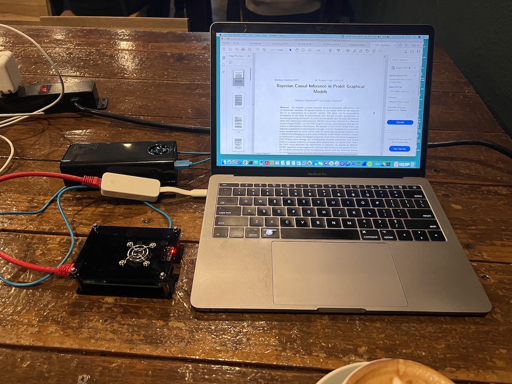
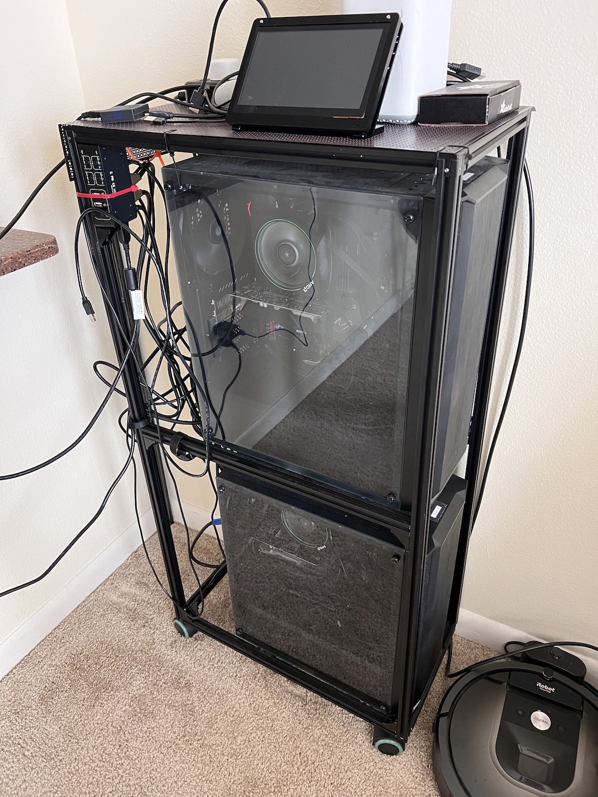

# Next Generation Virtual Private Network
I'd like to share my efforts for making a Next Generation Virtual Private Network here.

For this project, I did the following steps and will explain each separately.

# Hardware
There are many hardware firewalls in the market. For example 
- Best firewalls for small businesses [link](https://www.digitaltrends.com/computing/best-firewalls-for-small-businesses/)
- Cisco Meraki MX - $102.33


Some of the more advanced firewalls use FPGA, such as Palo Alto Networks PA-7000 series [link](https://www.paloaltonetworks.com/resources/pa-series-next-generation-firewalls-hardware-architectures)


## Can we make the hardware from scratch? YES
I used two hardwares:
- I used the simplest processor: Raspberry pi 4


- I also made more advanced version with FPGA Network Interface Card


(I will add the list of the Components soon)


# Linux OS
For making a VPN you need to make an operation system. One of the best options are making a new distribution from Linux. You also need the kernel programming knowledge.

## Why we need a new OS (linux distribution of linux)?
- Security reasons (we don't know if there is any hidden code inside the distributions).
- Flexibility
- Lightweight (there are many packages in Ubuntu that are not used in firewall such as audio/video)

## Can we create a new distribution of Linux from source? Yes
But it is very hard and needs lots of linux knowledge.
Linux kernel had over 30 million lines of code!


## Linux from Scratch
I will add the codes and log files here soon.

You can start learning about making a linux from scratch [here](https://www.linuxfromscratch.org/)

Before you start making a linux, you need to know the
- Cross-compiling
- Canadian compiling


### List of packages to make the minimal linux OS
For making a minimal linux distribution, you need to compile ~ 100 packages.
Here is a list of the fundamental packages:

```
Binutils-2.39 - Pass 1
GCC-12.2.0 - Pass 1
Linux-5.19.2 API Headers
Glibc-2.36
Libstdc++ from Man-pages-5.13
Iana-Etc-20220812
Glibc-2.36
Zlib-1.2.12
Bzip2-1.0.8
Xz-5.2.6
Zstd-1.5.2
File-5.42
Readline-8.1.2
M4-1.4.19
Bc-6.0.1
Flex-2.6.4
Tcl-8.6.12
Expect-5.45.4
Binutils-2.39
GMP-6.2.1
Libcap-2.65
Shadow-4.12.2
GCC-12.2.0
Sed-4.8
Bison-3.8.2
Grep-3.7
Bash-5.1.16
Automake-1.16.5
OpenSSL-3.0.5
Kmod-30
Libelf from Elfutils-0.187
Libffi-3.4.2
Python-3.10.6
Wheel-0.37.1
Ninja-1.11.0
Meson-0.63.1
Coreutils-9.1
Check-0.15.2
```


For an advanced firewall you need ~ 700 packages.


### booting
One of the challenging part was to boot the hardware with my new Linux distribution. 

Raspberry Pi has no BIOS! To boot the Raspberry Pi, I tried more than 350 times with different bootloaders:
```
Grub
EFI
U-boot
Dracut
```


# Configurations and settings
## How to make a router?
How to allow traffic pass through the device?

A router is a network device that connects two networks together.
If you have two Ethernet ports on a computer, with different networks on each, your computer can act as a router.

## We have two interfaces (eth0 and wlan0) in the device (firewall), which one should be the default router?
For example in the device, you ping google.com, how to tell it should it route through wlan0 while keeping both ports as default?


# Components (ip blocking, VPN, IPsec, TLS/SSL tunneling, url filtering, proxy, intrusion detection, QoS, UI, ML, ...)

## What is Next-generation firewall
A good reference from [Cisco](https://www.cisco.com/c/en/us/products/security/firewalls/what-is-a-next-generation-firewall.html)

- deep packet inspection (DPI),
- an intrusion prevention system (IPS). 
- TLS/SSL encrypted traffic inspection, 
- website filtering, 
- QoS/bandwidth management,
- antivirus inspection
- third-party identity management integration (i.e. LDAP, RADIUS, Active Directory)

Protection based on ports, protocols, IP addresses is no more reliable and viable. This has led to the development of identity-based security approach
NGFW: application awareness and control, integrated intrusion prevention, and cloud-delivered threat intelligence.

## Proxy server
For the Proxy server, I use the `squid` package.
Here is an example to filter facebook that it works great:

```
$ curl -v -x http://192.168.0.1:3128 http://www.facebook.com/
*   Trying 192.168.0.1:3128...
* TCP_NODELAY set
* Connected to 192.168.0.1 (192.168.0.1) port 3128 (#0)
> GET http://www.facebook.com/ HTTP/1.1
> Host: www.facebook.com
> User-Agent: curl/7.68.0
> Accept: */*
> Proxy-Connection: Keep-Alive
> 
* Mark bundle as not supporting multiuse
< HTTP/1.1 403 Forbidden
< Server: squid/5.7
< Mime-Version: 1.0
< Date: Mon, 31 Oct 2022 00:03:53 GMT
< Content-Type: text/html;charset=utf-8
< Content-Length: 3506
< X-Squid-Error: ERR_ACCESS_DENIED 0
< Vary: Accept-Language
< Content-Language: en
< X-Cache: MISS from aaaa
< X-Cache-Lookup: NONE from aaaa:3128
< Via: 1.1 aaaa (squid/5.7)
< Connection: keep-alive
```


## intrusion detection
It will come soon
